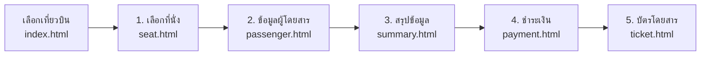
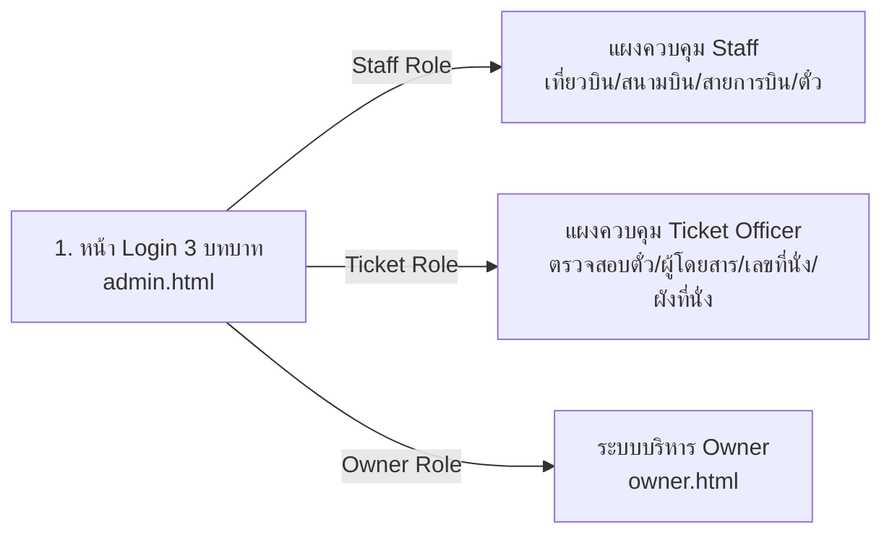
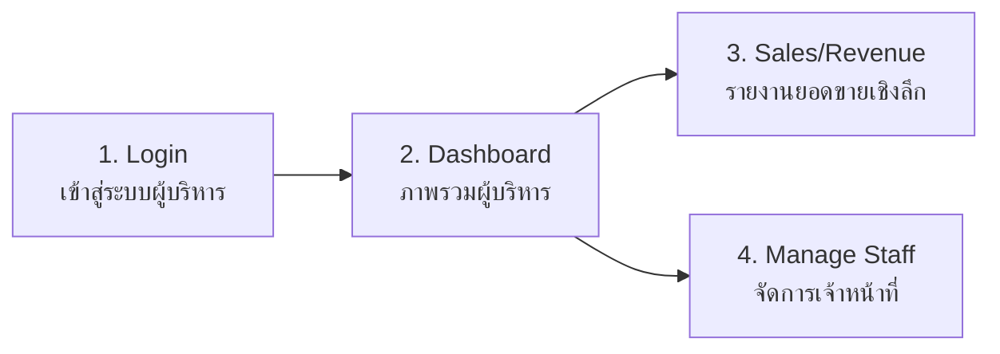

# ✈️ Xfly-Anyway Airlines — ระบบจองตั๋วเครื่องบินออนไลน์ & ระบบจัดการครบวงจร

ระบบบริหารจัดการและจองตั๋วเครื่องบินออนไลน์ระดับพรีเมียม (Premium Aviation Platform) พัฒนาด้วยสถาปัตยกรรมแบบแยกโมดูลไฟล์ตามหน้าที่การทำงาน (Separation of Concerns) ครอบคลุมการทำงานครบทั้ง 4 บทบาท: **Customer (ผู้โดยสาร)**, **Owner (เจ้าของกิจการ/ผู้บริหารสูงสุด)**, **Staff (เจ้าหน้าที่ฝ่ายปฏิบัติการ)**, และ **Ticket Officer (เจ้าหน้าที่ตรวจสอบตั๋วและผังที่นั่ง)** พร้อมรองรับทั้งเส้นทางบินในประเทศและเส้นทางบินต่างประเทศระดับพรีเมียม (Tokyo, Singapore, Seoul, London ฯลฯ)

---

## 🎯 แผนผังการทำงานตาม Requirements (System Workflows)

### 1. 👤 Customer Flow (สำหรับลูกค้า/ผู้โดยสาร)


* **Step 1: Seat (เลือกที่นั่ง — seat.html)** — หน้าแรกมีตัวกรองเส้นทางบิน: **✈️ ทุกเส้นทาง**, **🇹🇭 ในประเทศ**, และ **🌐 ต่างประเทศ** (Tokyo NRT/HND, Singapore SIN, Seoul ICN, London LHR) เมื่อเลือกเที่ยวบิน ระบบจะนำเข้าสู่หน้าเลือกที่นั่งก่อนเสมอ ผ่าน Interactive Aircraft Seat Map ให้บริการเฉพาะห้องโดยสารระดับพรีเมียม **👑 First Class (แถว 1-2)** และ **✨ Business Class (แถว 3-12)** *(ไม่มีชั้น Economy)* พร้อมระบบล็อกที่นั่ง 10 นาทีแบบ Real-time
* **Step 2: Passenger (ข้อมูลผู้โดยสาร — passenger.html)** — กรอกคำนำหน้า, ชื่อ-นามสกุล, เบอร์โทร, อีเมล, หมายเลขบัตรประชาชน/หนังสือเดินทาง, วันเกิด, และความต้องการพิเศษ
* **Step 3: Summary (สรุปข้อมูลการจอง — summary.html)** — ตรวจทานข้อมูลเที่ยวบิน, ข้อมูลผู้โดยสาร, เลขที่นั่ง และแจกแจงรายละเอียดค่าบริการ (ค่าตั๋ว, VAT 7%, ค่าธรรมเนียมสนามบิน) ก่อนชำระเงิน
* **Step 4: Payment (ชำระเงิน — payment.html)** — รองรับทั้งระบบเงินสดและคริปโตเคอร์เรนซี: บัตรเครดิต/เดบิต, PromptPay QR Code, TrueMoney Wallet, **₿ Bitcoin (BTC)** และ **Ξ Ethereum (ETH)** พร้อมการคำนวณอัตราแลกเปลี่ยนแบบ Real-time, QR Code และปุ่มคัดลอก Wallet Address
* **Step 5: Ticket (บัตรโดยสาร — ticket.html)** — ออกบัตรโดยสารอิเล็กทรอนิกส์ (E-Ticket) พร้อม QR Code, รหัสการจอง PNR, ชั้นที่นั่ง (First Class / Business Class), ช่องทางชำระเงิน และรองรับการสั่งพิมพ์ตั๋ว (`window.print()`)

---

### 2. 🛡️ Staff & 🎫 Ticket Officer Flow (ระบบเจ้าหน้าที่)


* **Interactive 3-Role Switcher:** หน้าเข้าสู่ระบบมีแถบกดเลือกบทบาท 3 แท็บ `[👑 Owner]`, `[🛡️ Staff]`, `[🎫 Ticket]` พร้อมกล่องคลิกกรอกข้อมูลรหัสผ่านอัตโนมัติ (1-Click Fill)
* **Staff Dashboard:** บริหารเที่ยวบิน (CRUD เที่ยวบินใน/ต่างประเทศ), จัดการสนามบิน IATA, จัดการสายการบิน, ตรวจสอบตั๋ว และระบบทดสอบจองที่นั่งอัตโนมัติ
* **Ticket Officer Console:** หน้าเฉพาะสำหรับฝ่ายตั๋วโดยสาร แสดงแบนเนอร์สีทอง **🎫 TICKET OFFICER CONSOLE**, ตารางบัตรโดยสารแสดงรหัสการจอง ผู้โดยสาร และ **🪑 เลขที่นั่งทองคำ** อย่างชัดเจน พร้อมปุ่มเปิดดูผังที่นั่งเที่ยวบิน (Seat Map Inspection) แบบ Read-only เพื่อตรวจสอบความถูกต้องทันที

---

### 3. 👑 Owner Flow (สำหรับเจ้าของกิจการ / ผู้บริหารสูงสุด)


* **Login (เข้าสู่ระบบผู้บริหาร):** ระบบตรวจสอบสิทธิ์ความปลอดภัยระดับผู้บริหาร (Executive Authentication Guard)
* **Dashboard (แดชบอร์ดภาพรวม):** สรุปดัชนีชี้วัดทางธุรกิจ (Executive KPIs): ยอดขายสุทธิ (Net Revenue), จำนวนตั๋วที่จำหน่ายได้, ยอดซื้อเฉลี่ยต่อคำสั่งซื้อ (AOV), สถิติ 4 อันดับเส้นทางบินทำเงินสูงสุด (Top Routes), สัดส่วนรายได้ระหว่าง First Class vs Business Class
* **Sales / Revenue (รายงานยอดขายและรายได้):** ตารางแจกแจงรายได้เชิงลึกตามรายเที่ยวบิน, สัดส่วนรายได้แยกตามชั้นที่นั่ง (First Class & Business Class), อัตราการบรรทุกผู้โดยสาร, พร้อมปุ่มสั่งพิมพ์รายงานสรุปผลประกอบการ
* **Manage Staff (จัดการเจ้าหน้าที่):** ระบบ CRUD จัดการบัญชีเจ้าหน้าที่: สร้างบัญชี Staff ใหม่ (ชื่อ, อีเมล, รหัสผ่าน, แผนก, Role), สั่งพักการใช้งาน (Suspend) / เปิดใช้งาน (Active), และลบบัญชี Staff

---

## 📁 โครงสร้างไฟล์ในโปรเจค (File Architecture)

โปรเจคถูกจัดระเบียบแยกตามหน้าที่อย่างชัดเจน:

```
Xfly-project/
├── index.html              # [Customer] หน้าหลัก & ค้นหาเที่ยวบิน (Search & Flight Selection)
├── passenger.html          # [Customer] กรอกข้อมูลผู้โดยสาร (Passenger Details)
├── seat.html               # [Customer] ผังเลือกที่นั่งบนเครื่องบิน (Seat Map Selection)
├── summary.html            # [Customer] สรุปข้อมูลการจองและคำนวณราคา (Booking Summary)
├── payment.html            # [Customer] ช่องทางชำระเงิน & ตัวนับเวลาถอยหลัง (Payment Gateway)
├── ticket.html             # [Customer] บัตรโดยสารอิเล็กทรอนิกส์ (Digital E-Ticket)
├── history.html            # [Customer] ประวัติการจองล่าสุดของผู้ใช้ (Latest Booking History)
│
├── admin.html              # [Admin] ประตูทางเข้าระบบ Admin & แผงควบคุมหลัก
├── admin/
│   └── index.html          # [Admin] รองรับการเข้าถึงผ่าน URL /admin โดยตรง
│
├── owner.html              # [Owner] ประตูทางเข้าระบบผู้บริหารระดับสูง (Executive Owner Portal)
│
├── css/
│   └── style.css           # สไตล์ชีตรวมทั้งระบบ (ธีม Yellow-Black / Glassmorphism / Print styles)
│
├── js/
│   ├── storage.js          # จัดการข้อมูล LocalStorage (Airports, Airlines, Flights, Admins, Bookings)
│   ├── main.js             # ควบคุมการทำงานหน้า index.html (Search & Filter เที่ยวบิน)
│   ├── passenger.js        # ตรวจสอบและบันทึกข้อมูลผู้โดยสารใน passenger.html
│   ├── booking.js          # จัดการผังที่นั่งและการล็อกที่นั่ง 10 นาทีใน seat.html
│   ├── summary.js          # คำนวณราคา, VAT 7%, ค่าธรรมเนียมใน summary.html
│   ├── payment.js          # จัดการระบบชำระเงินและบันทึกการออกตั๋วใน payment.html
│   ├── ticket.js           # ดึงข้อมูลการจองมาแสดงเป็น E-Ticket ใน ticket.html
│   ├── history.js          # ดึงประวัติการจองล่าสุดและจัดการการยกเลิกใน history.html
│   │
│   ├── admin.js            # ควบคุมระบบ Auth และสถิติ Dashboard ของ Admin
│   ├── admin-flights.js    # โมดูล CRUD จัดการเที่ยวบิน (Manage Flight)
│   ├── admin-airports.js   # โมดูล CRUD จัดการสนามบิน (Manage Airport)
│   ├── admin-airlines.js   # โมดูล CRUD จัดการสายการบิน (Manage Airline)
│   ├── admin-tickets.js    # โมดูลค้นหาและตรวจสอบตั๋วโดยสาร (View Ticket)
│   ├── admin-test-booking.js # โมดูลจำลองการจองและล็อกที่นั่งอัตโนมัติ (Auto-Book Test)
│   │
│   ├── owner.js            # ควบคุมระบบ Auth และ Executive KPIs ของ Owner
│   ├── owner-revenue.js    # โมดูลรายงานและวิเคราะห์ยอดขายเชิงลึก (Sales & Revenue)
│   ├── owner-admins.js     # โมดูล CRUD จัดการบัญชีแอดมิน (Manage Admin)
│   └── supabase-config.js  # การตั้งค่าเชื่อมต่อ Supabase Database (ถ้าใช้งาน)
│
└── package.json            # การตั้งค่าโปรเจคและคำสั่งเริ่มเซิร์ฟเวอร์
```

---

## 🔑 บัญชีเริ่มต้นและสิทธิ์การใช้งาน (Role Credentials & Matrix)

หน้าล็อกอิน `admin.html` และ `owner.html` มีแถบกดเลือกบทบาท 3 สิทธิ์ พร้อมปุ่มคลิกกรอกรหัสผ่านอัตโนมัติ (1-Click Fill):

| บทบาท (Role) | URL เข้าใช้งาน | อีเมล (Email) | รหัสผ่าน (Password) | ตารางฐานข้อมูล | สิทธิ์การเข้าถึงและการทำงาน |
| :--- | :--- | :--- | :--- | :--- | :--- |
| **🎫 Ticket Officer (เจ้าหน้าที่ตรวจสอบตั๋ว)** | `admin.html` (แท็บ Ticket) | `ticket@xfly.com` | `ticket1234` | `public.admins` (role: `ticket`) | ตรวจสอบบัตรโดยสารทั้งหมด, ดูรายชื่อผู้โดยสาร, ดูเลขที่นั่งและชั้นที่นั่งอย่างละเอียด, เปิดดูผังที่นั่งเที่ยวบิน (Seat Map) แบบ Read-only *(ซ่อนเมนูแก้ไขเที่ยวบิน/สนามบินเพื่อความปลอดภัย)* |
| **🛡️ Staff (เจ้าหน้าที่ฝ่ายปฏิบัติการ)** | `admin.html` (แท็บ Staff) | `staff@xfly.com` (หรือ `admin@xfly.com`) | `staff1234` (หรือ `admin1234`) | `public.admins` (role: `staff`) | จัดการเที่ยวบิน (CRUD), จัดการสนามบิน, จัดการสายการบิน, ตรวจสอบและยกเลิกตั๋ว, ระบบทดสอบจองที่นั่งอัตโนมัติ *(ห้ามเข้า Owner)* |
| **👑 Owner (ผู้บริหารสูงสุด)** | `owner.html` (แท็บ Owner) | `owner@xfly.com` | `owner1234` | `public.owners` (role: `owner`) | แดชบอร์ดผู้บริหาร (KPIs), รายงานยอดขายและรายได้สุทธิ, จัดการสร้าง/ระงับ/ลบบัญชี Staff และ Ticket Officer |

> 🔒 **ระบบความปลอดภัย (Security Separation Guard):** 
> หากผู้ใช้เลือกแท็บ Owner ในหน้า Staff ระบบจะเชื่อมต่อไปยังหน้า Owner Portal ทันที และมีการป้องกันการใช้รหัสผ่านข้ามบทบาทเพื่อความถูกต้องและปลอดภัยสูงสุด

---

## 🚀 วิธีการติดตั้งและรันโปรเจค (How to Run Locally)

### 1. เปิด Terminal / PowerShell ในโฟลเดอร์โปรเจค
```bash
# ติดตั้ง serve หรือรันผ่านคำสั่ง npm
npm start
```
หรือใช้คำสั่ง:
```bash
npx -y serve . -l 3000
```

### 2. เปิดเว็บบราวเซอร์
* **หน้าเว็บไซต์สำหรับลูกค้า (Customer):** [http://localhost:3000](http://localhost:3000)
* **หน้าระบบเจ้าหน้าที่ (Staff Portal):** [http://localhost:3000/staff.html](http://localhost:3000/staff.html) (หรือ `admin.html`)
* **หน้าผู้บริหารระดับสูง (Owner Portal):** [http://localhost:3000/owner.html](http://localhost:3000/owner.html)

---

## 🗄️ การติดตั้งและอัพเดทฐานข้อมูล Supabase (Database Setup & Schema)

ระบบรองรับการทำงานร่วมกับ **Supabase PostgreSQL** แบบสมบูรณ์ โดยมีไฟล์ Schema DDL/DML อยู่ที่ [`supabase_schema.sql`](file:///c:/Users/Lenovo/OneDrive/เอกสาร/Xfly-project/supabase_schema.sql)

### โครงสร้างตารางในฐานข้อมูล (Database Tables):
1. **`airports` (ตารางสนามบิน):** `code` (PK), `name`, `city`, `country`, `active`, `created_at` (พร้อมข้อมูลสนามบินหลักทั่วไทย)
2. **`airlines` (ตารางสายการบิน):** `code` (PK), `name`, `country`, `fleet`, `status`, `logo`, `created_at` (ตั้งต้นสายการบิน **Xfly-Anyway Airlines** รหัส `XF`)
3. **`flights` (ตารางเที่ยวบิน):** `id` (PK), `airline_code`, `airline_name`, `from_code`, `from_city`, `from_name`, `to_code`, `to_city`, `to_name`, `departure`, `arrival`, `duration`, `price`, `seats_business`, `seats_economy`, `created_at` (เที่ยวบิน XF101 - XF606)
4. **`bookings` (ตารางการจองและตั๋ว):** `id` (PK), `user_id`, `flight_id`, `airline_name`, `seat_id`, `seat_class`, `base_price`, `total_price`, `payment_method`, `passenger_title`, `passenger_name`, `passenger_email`, `passenger_phone`, `passenger_id_number`, `flight_from`, `flight_to`, `departure`, `arrival`, `status`, `booked_at`, `cancelled_at`
5. **`seat_locks` (ตารางล็อกที่นั่ง Real-time):** `flight_seat_id` (PK), `flight_id`, `seat_id`, `status`, `session_id`, `booking_id`, `locked_at`, `updated_at`
6. **`admins` (ตารางบัญชีผู้ดูแลระบบ):** `id` (PK), `name`, `email` (Unique), `password`, `role`, `department`, `status`, `created_at`
7. **`profiles` (ตารางโปรไฟล์ลูกค้า):** `id` (PK, UUID), `name`, `phone`, `role`, `created_at`

### ขั้นตอนการรัน Migration บน Supabase Dashboard:
1. เข้าไปที่ [Supabase Dashboard](https://supabase.com/dashboard) แล้วเลือกโปรเจคของคุณ (`lcqabitvqdytuljhdkks`)
2. คลิกที่เมนู **"SQL Editor"** จากแถบเครื่องมือด้านซ้าย
3. คลิกปุ่ม **"+ New query"**
4. คัดลอกโค้ดทั้งหมดจากไฟล์ [`supabase_schema.sql`](file:///c:/Users/Lenovo/OneDrive/เอกสาร/Xfly-project/supabase_schema.sql) ไปวางในช่องข้อความ
5. คลิกปุ่ม **"Run"** สีเขียวทางขวาล่าง
6. ระบบจะสร้างตารางทั้งหมด อัพเดทฟิลด์ตารางเดิมที่ขาดหาย เชื่อมความสัมพันธ์ Foreign Keys พร้อมเปิด Row Level Security (RLS) และเพิ่มข้อมูลตั๋ว/เที่ยวบิน/สายการบินให้อัตโนมัติทันที

---

## 💡 จุดเด่นและเทคโนโลยีที่ใช้ (Key Highlights)
1. **Zero External Framework Dependency:** เขียนด้วย Vanilla HTML5, CSS3 (Modern Glassmorphism & Gold Theme), และ JavaScript ES6+ ทำให้โหลดเร็วและเปิดได้ทันทีโดยไม่ต้องติดตั้ง Build Tools ซับซ้อน
2. **Real-time 10-Minute Seat Hold Mechanism:** ระบบล็อกที่นั่งชั่วคราว 10 นาทีระหว่างดำเนินการจองและชำระเงิน เพื่อป้องกันการจองที่นั่งซ้ำซ้อน
3. **Print-ready E-Ticket:** หน้าบัตรโดยสารรองรับการจัดวาง Layout และสั่งพิมพ์ (`window.print()`) หรือบันทึกเป็น PDF ได้ทันที
4. **Dynamic Data Layer & Two-Way Sync:** ข้อมูลสนามบิน, สายการบิน, เที่ยวบิน, แอดมิน และการจองทั้งหมดถูกเก็บและซิงค์แบบ Two-Way Real-time ผ่าน Storage Module ระหว่าง LocalStorage และ Supabase Cloud Database โดยอัตโนมัติ
